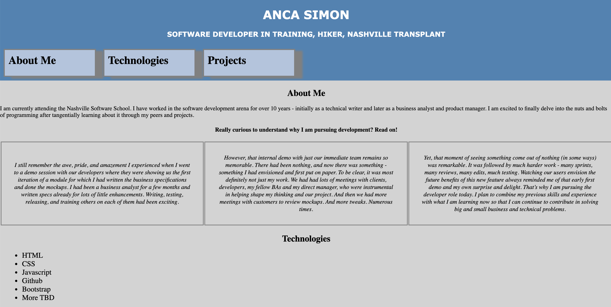

# Anca Simon Personal Bio Site

## Description
This project is the beginning of our personal portfolio site. It gives an introduction to using arrays to dynamically create a list of items that will be displayed on the screen. Instructions can be found [here](https://github.com/nss-nightclass-projects/personal-bio-site-instructions/blob/master/personal-bio-site-01.md).

## Screenshots
##### Home Page

## How to Run
1. Clone down this repo.
1. Make sure you have http-server installed via npm. If not, get it [here](https://www.npmjs.com/package/http-server).
1. On your command line, run `hs -p 9999`.
1. In your browser, navigate to `http://localhost:9999`.
