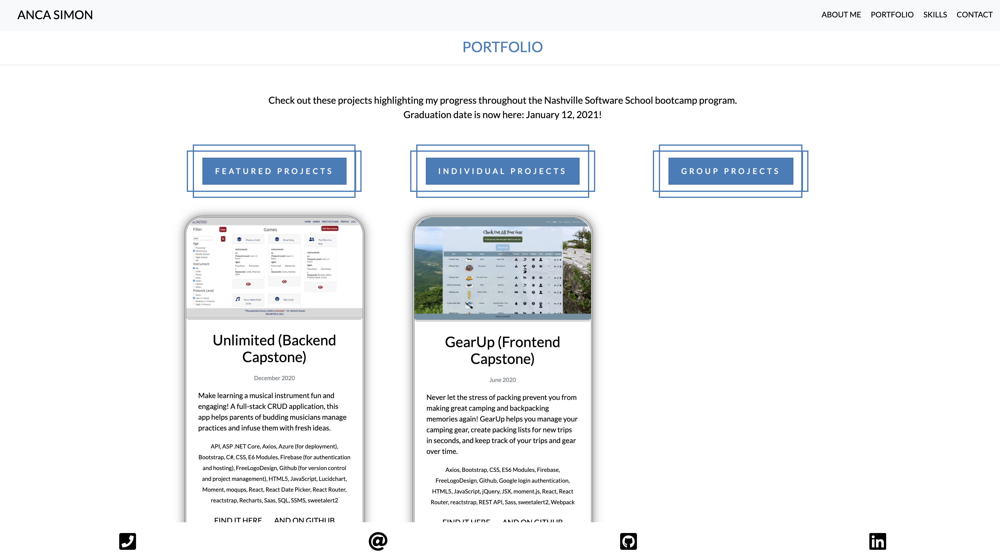

# Anca Simon Personal Bio Site

## Description
This is my personal portfolio site. It allows visitors to my site to learn about my background, find out why I am a software developer today, and get a glimpse of the projects I have developed as a student at the Nashville Software School. This site also showcases the technologies and tools we have learned during our NSS 12-month intensive bootcamp program. 

## Screenshots
##### Home Page

##### About Me Section

##### Projects Section

##### Skills Section

##### Contact Page

###### Image Sources
* https://icons8.com/icons/pack/user-interface 
* https://github.com/FortAwesome/Font-Awesome/tree/master/svgs 

## How to Run
1. Clone down this repo.
1. Make sure you have http-server installed via npm. If not, get it [here](https://www.npmjs.com/package/http-server).
1. On your command line, run `hs -p 9999`.
1. In your browser, navigate to `http://localhost:9999`.

## Firebase Deployment
This project has been deployed with Firebase. 
You can access it [here](https://pinterest-4b62d.web.app/). 
